# Adote um Amigo

Plataforma academica de adocao de animais com frontend React, backend Node.js/Express, MongoDB, Docker, JWT, painel administrativo, Swagger, testes de carga com k6 e observabilidade com Prometheus/Grafana.

## Estado Atual

O projeto roda localmente com Docker Compose e possui:

- Frontend publico para visualizar animais e solicitar adocao.
- Backend Node.js com API REST.
- MongoDB para usuarios, animais e solicitacoes de adocao.
- Login admin com JWT.
- Painel admin em HTML/JS servido pelo proprio backend.
- CRUD completo de animais protegido por JWT e role `admin`.
- Listagem publica combinando animais do MongoDB + Dog API + Cat API.
- Swagger em `/api-docs`.
- Testes de carga com k6.

## Arquitetura

```text
.
|-- backend/                  # API Node.js/Express
|   |-- src/
|   |   |-- config/           # Conexao MongoDB
|   |   |-- controllers/      # Regras das rotas
|   |   |-- middleware/       # JWT, autorizacao e erros
|   |   |-- models/           # Schemas Mongoose
|   |   |-- public/           # Painel admin servido pelo backend
|   |   |-- routes/           # Rotas REST
|   |   |-- services/         # Bootstrap admin e servicos
|   |   |-- utils/            # Swagger, metricas e helpers
|   |   `-- app.js            # Entrada do backend
|   |-- Dockerfile
|   `-- backend.md
|
|-- frontend/                 # Aplicacao React publica
|   |-- public/
|   |-- src/
|   |   |-- components/
|   |   |-- pages/
|   |   |-- services/
|   |   |-- styles/
|   |   `-- utils/
|   |-- Dockerfile
|   |-- nginx.conf
|   `-- frontend.md
|
|-- db/                       # Arquivos auxiliares de banco
|   `-- db.md
|-- prints/                   # Prints e diagramas do projeto
|-- load-tests/k6/            # Testes de carga
|   `-- k6.md
|-- observability/            # Prometheus e Grafana
|   `-- observability.md
|-- docker-compose.yml
|-- .env.example
|-- package.json
`-- README.md
```

## Documentacao por Pasta

- [Backend](backend/backend.md)
- [Frontend](frontend/frontend.md)
- [Banco de dados](db/db.md)
- [Observabilidade](observability/observability.md)
- [Testes de carga k6](load-tests/k6/k6.md)

## Tecnologias

- Node.js
- Express
- MongoDB
- Mongoose
- React
- Docker e Docker Compose
- JWT
- bcrypt
- Swagger/OpenAPI
- k6
- Prometheus
- Grafana

## Como Rodar

Crie o arquivo `.env` com base no `.env.example` e suba a stack:

```bash
docker compose up -d --build
```

Ou use:

```bash
npm start
```

Verificar containers:

```bash
docker compose ps
```

Parar a stack:

```bash
docker compose down
```

## Links e Localhosts

| Recurso | URL / Conexao | Para que serve |
|---|---|---|
| Frontend publico | `http://localhost:3000` | Site publico para visualizar animais e solicitar adocao |
| Painel admin | `http://localhost:4000/admin` | Login admin e CRUD de animais |
| Swagger | `http://localhost:4000/api-docs` | Documentacao da API |
| Health check | `http://localhost:4000/health` | Verifica se o backend esta online |
| Metricas | `http://localhost:4000/metrics` | Metricas Prometheus expostas pelo backend |
| Prometheus | `http://localhost:9090` | Coleta metricas do backend |
| Grafana | `http://localhost:3001` | Dashboard visual das metricas |
| MongoDB porta padrao | `mongodb://localhost:27017` | MongoDB exposto pelo Docker |
| MongoDB Compass recomendado | `mongodb://127.0.0.1:27018/adote-um-amigo?directConnection=true` | Conexao mais estavel para visualizar o banco no Compass |

Banco no Compass:

```text
adote-um-amigo
```

Colecoes:

```text
users
animals
adoptionrequests
```

Grafana local:

```text
Usuario: admin
Senha:   admin
```

## Prints do Projeto

Esta secao apresenta os principais fluxos e ferramentas do projeto em funcionamento.

### Organizacao e requisitos

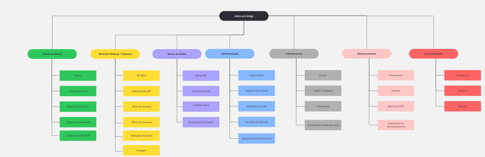

O diagrama resume os requisitos e etapas principais do projeto: criacao da aplicacao React, desenvolvimento da interface, consumo das APIs externas de caes e gatos, formulario de cadastro de interesse e publicacao da aplicacao.


O diagrama mostra a organizacao do frontend em `App.js`, componentes reutilizaveis, paginas e servicos. Ele ajuda a visualizar como as telas de inicio, lista de animais, detalhes, dicas, cadastro e rodape se conectam aos arquivos da aplicacao.

### Frontend publico

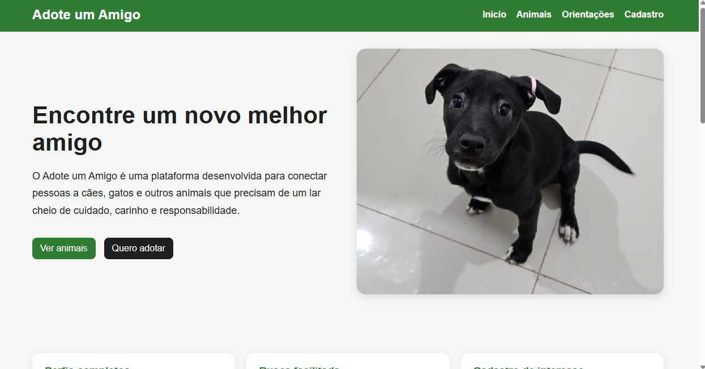

A tela inicial apresenta a proposta da plataforma, com navegacao superior, chamada principal para encontrar um novo companheiro e botoes de acesso rapido para a listagem de animais e cadastro de interesse.

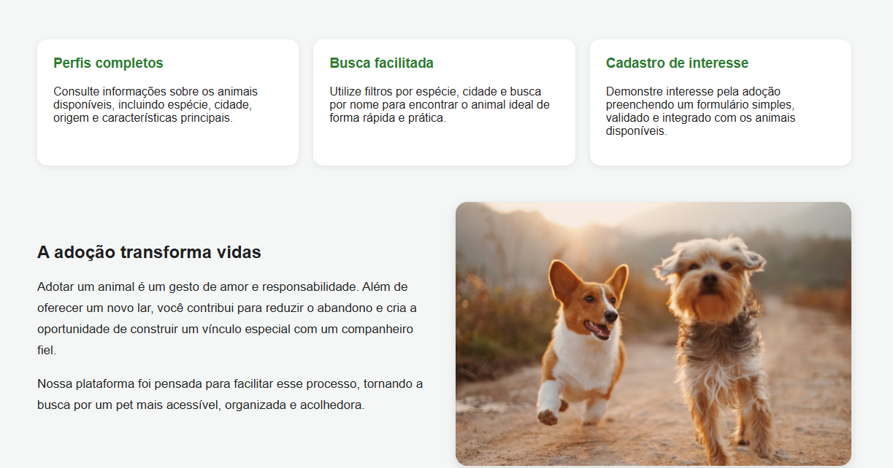

Esta parte da pagina inicial destaca os recursos oferecidos ao usuario, como perfis completos dos animais, busca facilitada e cadastro de interesse. A secao reforca o objetivo de tornar a adocao mais simples e acolhedora.

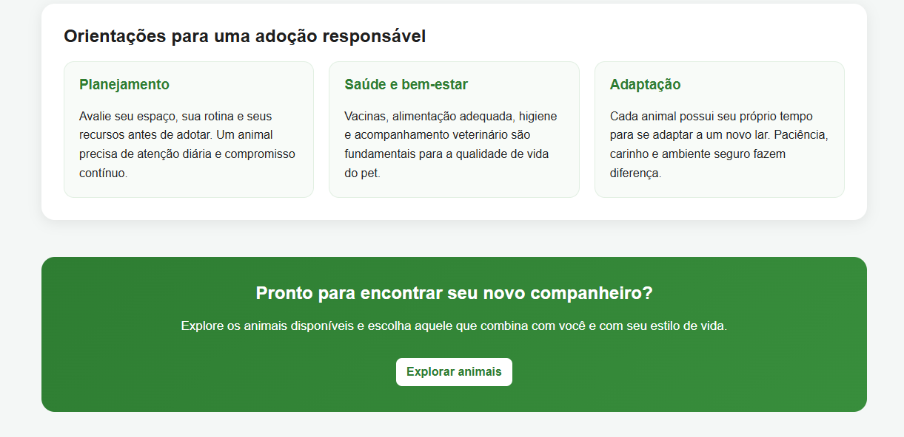

A secao final da pagina inicial apresenta orientacoes resumidas sobre adocao responsavel, incluindo planejamento, saude, bem-estar e adaptacao do animal ao novo lar.

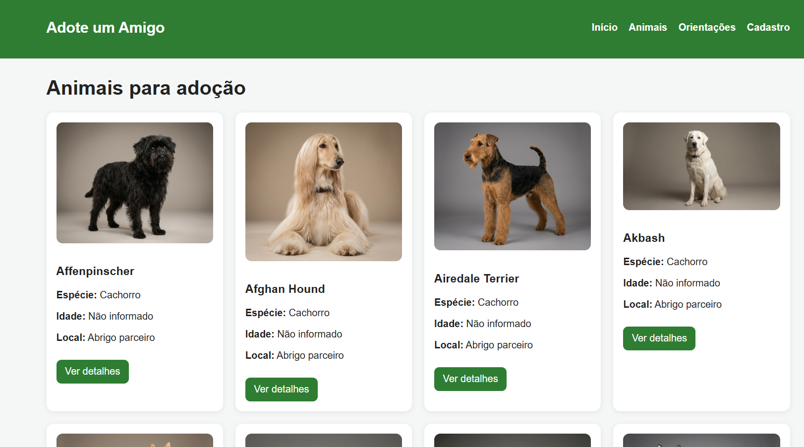

A listagem publica exibe os animais disponiveis para adocao. Nela o usuario pode buscar por texto, filtrar por especie e cidade, ordenar os resultados e acessar os cards individuais dos animais.

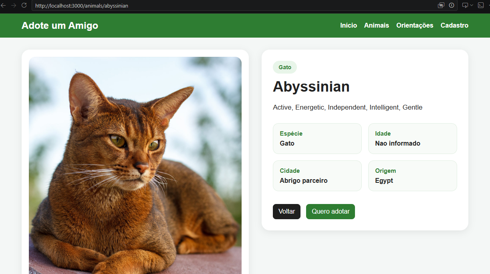

A pagina de detalhes mostra a ficha completa do animal selecionado, incluindo imagem, especie, idade, cidade, origem e descricao. A partir dela o usuario pode voltar para a lista ou iniciar o cadastro de interesse.

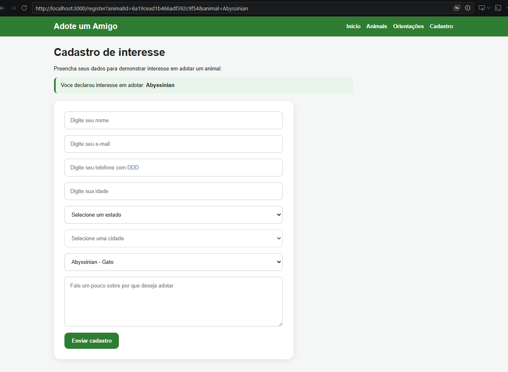

O formulario de cadastro permite que uma pessoa demonstre interesse em adotar um animal. Quando o fluxo vem da pagina de detalhes, o animal escolhido ja aparece selecionado no formulario.


A pagina de orientacoes reune cuidados importantes antes e depois da adocao, como alimentacao, higiene, acompanhamento veterinario, adaptacao em casa e responsabilidade de longo prazo.

### Painel administrativo

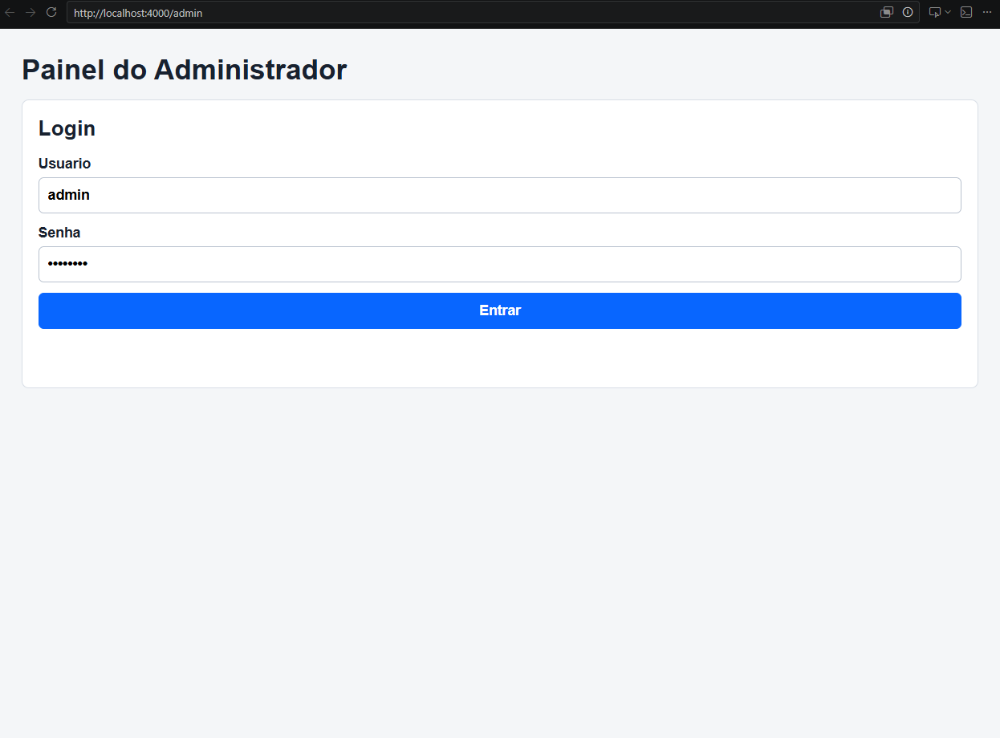

O painel administrativo inicia com a tela de login. O acesso usa as credenciais do administrador e, apos a autenticacao, o backend retorna um JWT usado nas rotas protegidas.

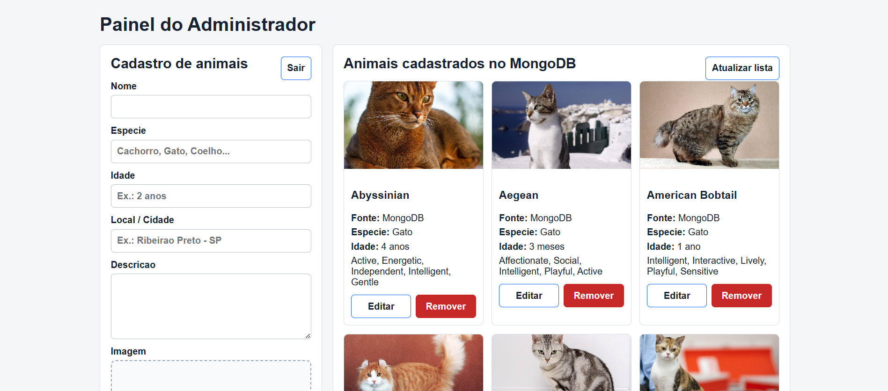

Depois do login, o administrador consegue cadastrar novos animais, enviar imagem, atualizar a lista, editar registros existentes e remover animais cadastrados no MongoDB.

### Documentacao da API

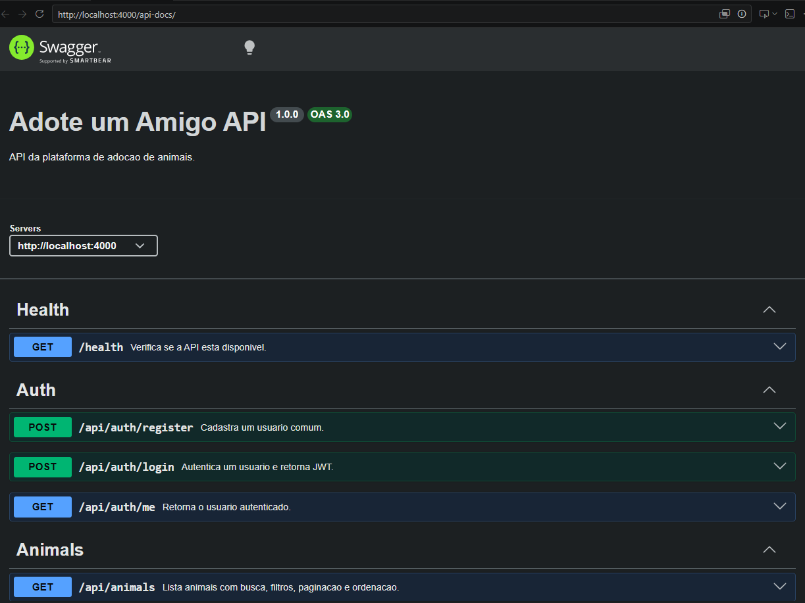

O Swagger documenta a API do backend, exibindo informacoes gerais, servidor local e grupos de rotas como health check, autenticacao e animais.

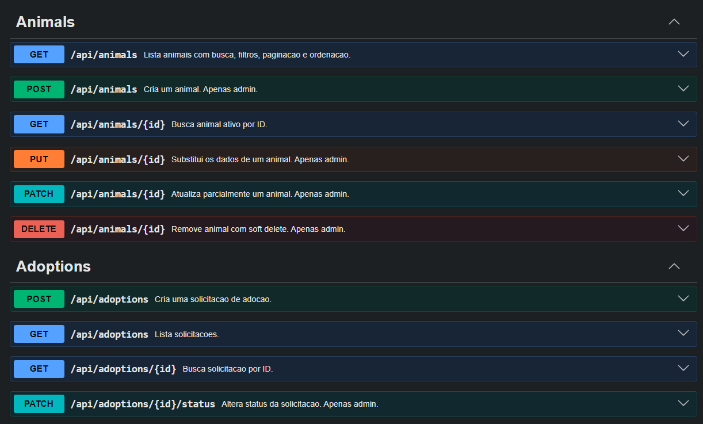

Nesta parte da documentacao aparecem as operacoes de animais e solicitacoes de adocao, incluindo rotas publicas, rotas administrativas e endpoints protegidos.

### Banco de dados

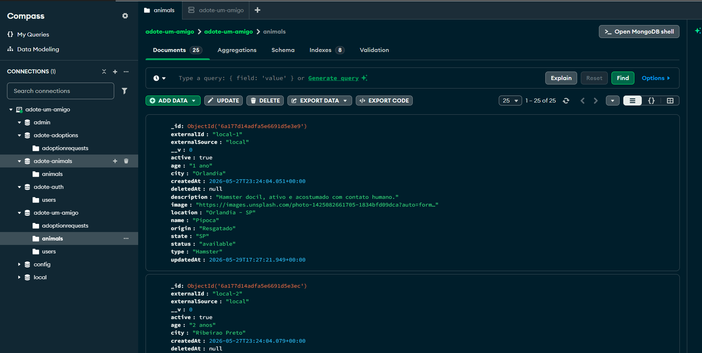

O MongoDB Compass permite visualizar os dados persistidos pela aplicacao. O print mostra o banco `adote-um-amigo`, suas colecoes e documentos da colecao `animals`.

### Observabilidade

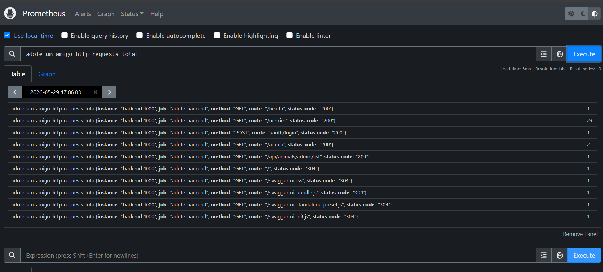

O Prometheus coleta as metricas expostas pelo backend em `/metrics`. O print mostra uma consulta da metrica `adote_um_amigo_http_requests_total`, usada para acompanhar requisicoes por rota, metodo e status HTTP.

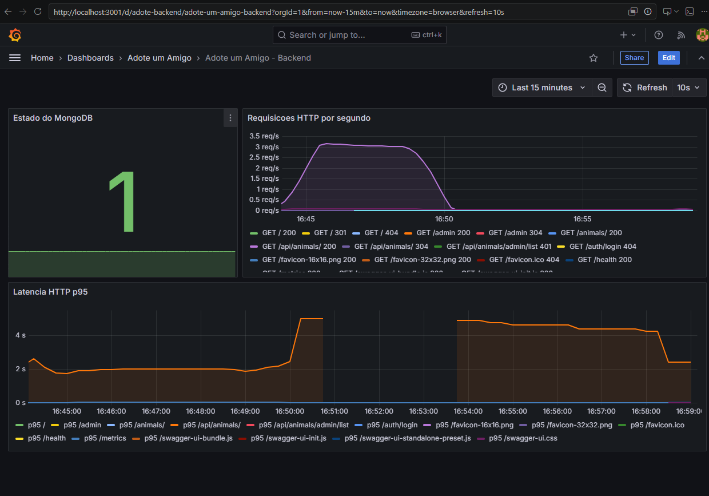

O Grafana consome os dados do Prometheus e apresenta um dashboard visual com estado da conexao MongoDB, requisicoes HTTP por segundo e latencia HTTP p95.

## Admin JWT

O backend cria/atualiza automaticamente o usuario admin ao iniciar:

```text
Usuario: admin
Senha:   admin123
Email:   admin@adote.local
Role:    admin
```

Login:

```http
POST /auth/login
POST /api/auth/login
```

Body:

```json
{
  "username": "admin",
  "password": "admin123"
}
```

Resposta: token JWT. O painel admin salva esse token no `localStorage` e envia nas acoes protegidas:

```http
Authorization: Bearer <token>
```

## Painel Admin

Acesse:

```text
http://localhost:4000/admin
```

Funcionalidades:

- Login com admin.
- Listagem de animais cadastrados no MongoDB.
- Cadastro de animal com imagem por clique ou arrastar/soltar.
- Edicao de animal.
- Remocao com modal de confirmacao.
- Mensagens de sucesso e erro.
- Estados de loading em botoes.
- Tratamento de token invalido ou expirado.

As rotas do painel usam JWT e role `admin`.


## API de Animais

A listagem publica combina dados do MongoDB com dados externos:

```http
GET /api/animals
GET /animals
```

Exemplo de resposta:

```json
{
  "items": [],
  "pagination": {
    "page": 1,
    "limit": 100,
    "total": 29,
    "pages": 1
  },
  "sources": {
    "mongodb": 18,
    "external": 24,
    "returned": 29
  }
}
```

Como funciona:

- Busca animais ativos no MongoDB.
- Busca racas/animais na Dog API e Cat API.
- Normaliza os dados para um formato unico.
- Remove duplicados usando `externalSource + externalId`.
- Retorna um JSON consistente para o frontend.

Listar somente MongoDB no painel admin:

```http
GET /api/animals/admin/list
```

Essa rota exige JWT admin.

## Rotas Principais

Autenticacao:

```text
POST /auth/login
POST /api/auth/register
POST /api/auth/login
GET  /api/auth/me
GET  /api/auth/users              # admin
PATCH /api/auth/users/:id/role    # admin
```

Animais:

```text
GET    /api/animals
GET    /animals
GET    /api/animals/admin/list    # admin
GET    /api/animals/external
GET    /api/animals/:id
POST   /api/animals               # admin
PUT    /api/animals/:id           # admin
PATCH  /api/animals/:id           # admin
DELETE /api/animals/:id           # admin
POST   /api/animals/import/dogs   # admin
POST   /api/animals/import/cats   # admin
```

Adocao:

```text
POST  /api/adoptions
GET   /api/adoptions              # autenticado
GET   /api/adoptions/:id          # autenticado
PATCH /api/adoptions/:id/status   # admin
```

## Observabilidade

O backend expoe metricas Prometheus:

```text
http://localhost:4000/metrics
```

Prometheus coleta as metricas do backend e Grafana ja vem com datasource e dashboard provisionados:

```text
Prometheus: http://localhost:9090
Grafana:    http://localhost:3001
```

Metricas incluidas:

- metricas padrao do Node.js;
- duracao de requisicoes HTTP;
- total de requisicoes HTTP;
- estado da conexao MongoDB.

## Testes de Carga

Scripts k6:

```bash
npm run load:animals
npm run load:adoption
```

Arquivos:

```text
load-tests/k6/animals-list.js
load-tests/k6/adoption-flow.js
```

## Observacoes Sobre Microservicos

O projeto usa containers separados para frontend, backend, MongoDB, Prometheus e Grafana. A aplicacao de dominio, porem, ainda esta em um unico backend Express. Portanto, ele esta modularizado, mas nao e uma arquitetura de microservicos completa.

Para evoluir para microservicos reais, uma sugestao seria separar:

- `auth-service`
- `animals-service`
- `adoptions-service`

cada um com container, porta, banco/colecoes ou contratos proprios.

## Ultimas Melhorias Incluidas

- Login admin `admin/admin123`.
- Senha com hash bcrypt.
- JWT com `role=admin`.
- Painel admin em `http://localhost:4000/admin`.
- CRUD completo de animais no painel.
- Upload simples de imagem com clique ou arrastar/soltar.
- Compressao de imagem no navegador antes do envio.
- Mensagens de sucesso, erro e loading.
- Modal de confirmacao para remover animal.
- Listagem publica compactada e responsiva.
- `GET /api/animals` combinando MongoDB + APIs externas.
- Porta MongoDB alternativa `27018` para uso no Compass.
- Prometheus e Grafana adicionados ao Docker Compose.
